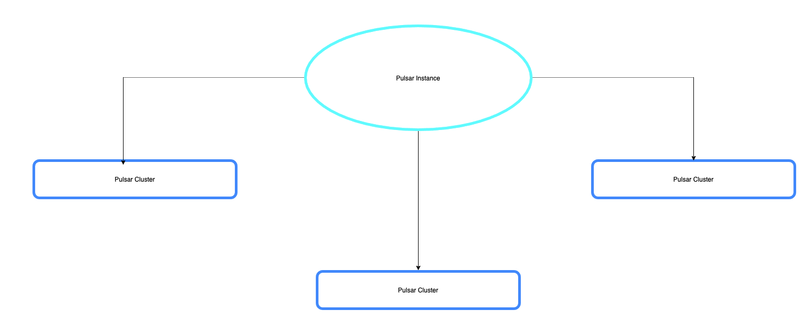

Pulsar Logical Components
-------------------------
- Pulsar was designed to serve as a multi-tenant system, allowing it to be shared across multiple departments within your organization by providing each with its own secure and isolated messaging environment - called units.
- Each unit within the shared environment is called a tenant.
- This design enables a single Pulsar instance to effectively be shared across your entire organization.

Pulsar Logical Components
-------------------------
1. **Tenant:**
    - is the most basic unit of categorization of topics.
    - can be spread across and isolated to different clusters
    - provide a security boundary within different parts of an organization each having their own tenant.
    - two configurable aspects: `Admin Roles` and `Allowed Clusters`

2. **Namespaces**
    - The administrative unit of the topic, which acts as a grouping mechanism for related topics.
    - Most topic configurations are performed at the namespace level.
    - Each tenant has one or multiple namespaces.

3. **Topics**
    - As in other pub-sub systems, topics in Pulsar are named channels for transmitting messages from producers to consumers.


Interacting with Pulsar using the CLI
-------------------------------------

Start a Pulsar standalone cluster
```
docker run -it \
  -p 6650:6650 \
  -p 8080:8080 \
  --name pulsar \
  --mount source=pulsardata,target=/pulsar/data \
  --mount source=pulsarconf,target=/pulsar/conf \
  apachepulsar/pulsar:2.7.1 \
  bin/pulsar standalone
```

Exec inside the container
```
docker exec -it pulsar /bin/bash
```

List the available clusters
```
bin/pulsar-admin clusters list

"standalone"
```

Get information for a cluster
```
bin/pulsar-admin clusters get standalone
```

List the existing tenants
```
bin/pulsar-admin tenants list
```

Create a new tenant
```
bin/pulsar-admin tenants create --admin-roles admin --allowed-clusters standalone investments
```

Get tenant information
```
bin/pulsar-admin tenants get investments

{
  "adminRoles" : [ "admin" ],
  "allowedClusters" : [ "standalone" ]
}
```

Create a namespace
```
bin/pulsar-admin namespaces create investments/stocks
```

Create a topic
```
bin/pulsar-admin topics create persistent://investments/stocks/stocks-ticker
```

List available topics
```
bin/pulsar-admin topics list investments/stocks
```

Start a Consumer on that topic
```
bin/pulsar-client consume -s "test-subs" -n 0 persistent://investments/stocks/stock-tickers
```   

Produce some records
```
bin/pulsar-client produce persistent://investments/stocks/stock-tickers -k AAPL -m "{"date":632700000000,"name":"AAPL","open":1.22,"close":1.22,"high":1.23,"low":1.2,"volume":2367300.0}" -s "\n"
bin/pulsar-client produce persistent://investments/stocks/stock-tickers -k MSFT -m "{"date":796424400000,"name":"MSFT","open":4.6,"close":4.52,"high":4.63,"low":4.5,"volume":4110700.0}" -s "\n"
bin/pulsar-client produce persistent://investments/stocks/stock-tickers -k GOOGL -m "{"date":1471986000000,"name":"GOOGL","open":796.86,"close":793.6,"high":798.46,"low":790.76,"volume":1284437.0}" -s "\n"
bin/pulsar-client produce persistent://investments/stocks/stock-tickers -k FB -m "{"date":1339534800000,"name":"FB","open":27.66,"close":27.27,"high":28.1,"low":27.1,"volume":1.7118672E7}" -s "\n"
bin/pulsar-client produce persistent://investments/stocks/stock-tickers -k AMZN -m "{"date":1528318800000,"name":"AMZN","open":1698.56,"close":1689.3,"high":1699.9,"low":1676.11,"volume":3765687.0}" -s "\n"
```

View topic stats
```
bin/pulsar-admin topics stats persistent://investments/stocks/stock-tickers
bin/pulsar-admin topics stats-internal persistent://investments/stocks/stock-tickers
```

View subscriptions on Topic
```
bin/pulsar-admin topics subscriptions persistent://investments/stocks/stock-tickers
```

Unsubscribe from a Topic
```
bin/pulsar-admin topics unsubscribe --subscription test-subs persistent://investments/stocks/stock-tickers
```

Peek Messages
```
bin/pulsar-admin topics peek-messages --count 10 --subscription test-subs persistent://investments/stocks/stock-tickers
```