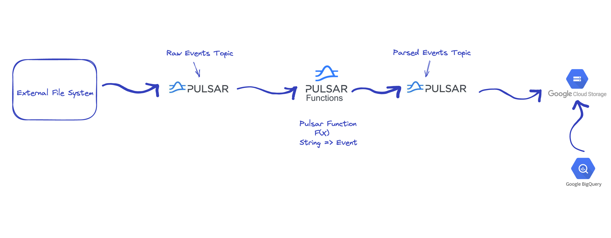

Apache Pulsar - GCS - BigQuery
==============================
This project demonstrates how you integrate Apache Pulsar with GCS in order to offload your data and then add BigQuery
on top in order to query them.

Sample Streaming Data Pipeline
---------------------


Make sure you have a kubernetes cluster up and running with enough resources to deploy a Pulsar Cluster

1. Create a namespace
```shell
kubectl create ns demo
```

2. Deploy a Pulsar Cluster
```shell
helm install \
--values k8s/values.yaml \
--set initialize=true \
pulsar streamnative/pulsar
```

3. Copy all the necessary resources on the cluster
```shell
./setup.sh
```
This script will execute and will do the following:
- Build the jars file containing our code
- Copy the connector jar file and the generated jar file on the cluster
- Copy the configuration scripts on the cluster
Make sure that the toolset pod name, matches the own of your pod - should be [installation-name]-toolset

4. Deploy the Pulsar Function along with the gcs connector
```shell
./deploy.sh
```

5. Expose the Pulsar Broker address if you want to run your producer from your local machine
```shell
kubectl port-forward service/pulsar-proxy 6650:6650 8080:8080 -n demo
```

6. Run the EventProducer

At this point you should have sent data into Pulsar and if you navigate to your Google Cloud Storage page
you should see 5 avro files. 

With your avro files in place, open a new tab for BigQuery and create a new table
